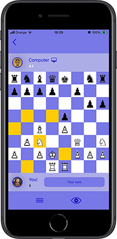

# Composable Chess

This is a chess app built with SwiftUI and ComposableArchitecture [https://github.com/pointfreeco/swift-composable-architecture]. The app is built in a clean and composable way from state, actions and reducers, where reducers are pure functions that give you the next state based on the current state. 

